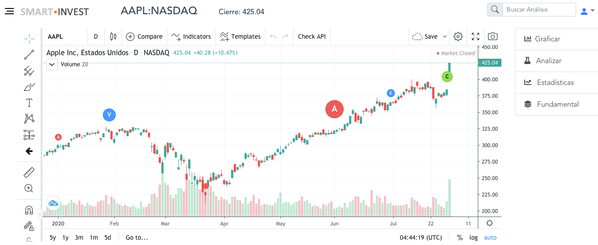

# SmartInvest

### Using Tradingview, VUE and python to scraping, procesing and analizing of stock data



## Project setup
```
npm install
```

### Compiles and hot-reloads for development
```
npm run serve

#### Copy charting_library.min.js to /src
#### Copy charting_library and datafeeds folder to /public from tradingview chart
```

### Compiles and minifies for production
```
npm run build
```

### Lints and fixes files
```
npm run lint
```

### Customize configuration
See [Configuration Reference](https://cli.vuejs.org/config/).
